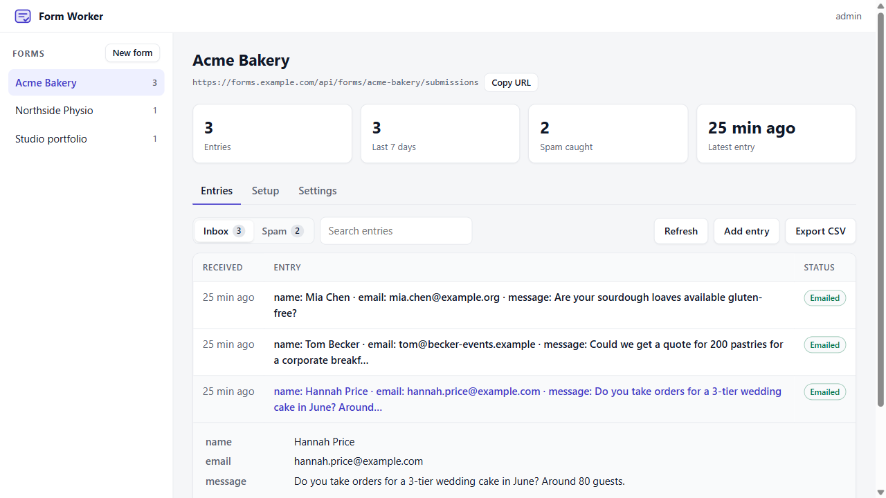
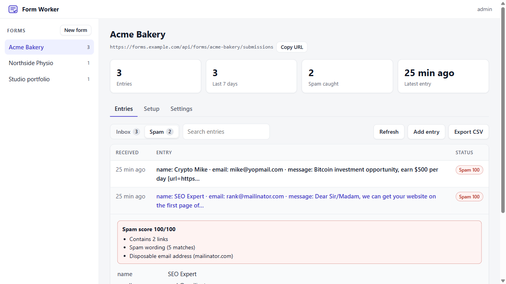
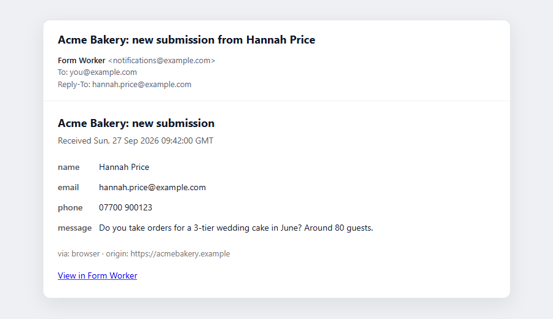
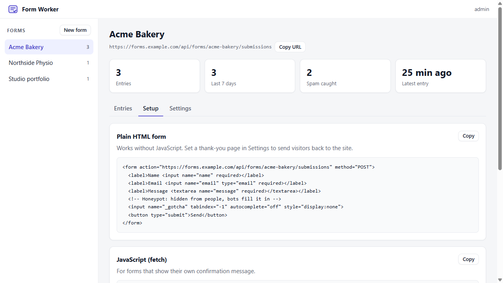
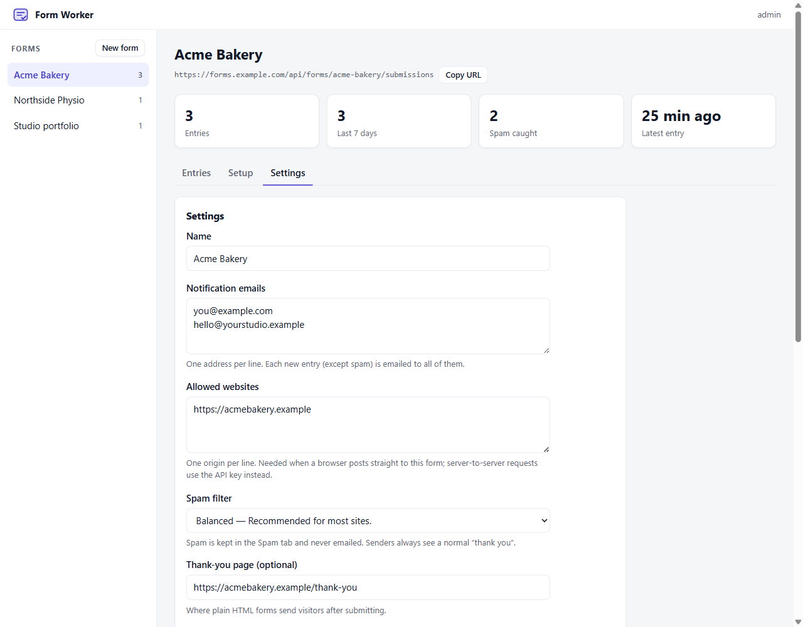
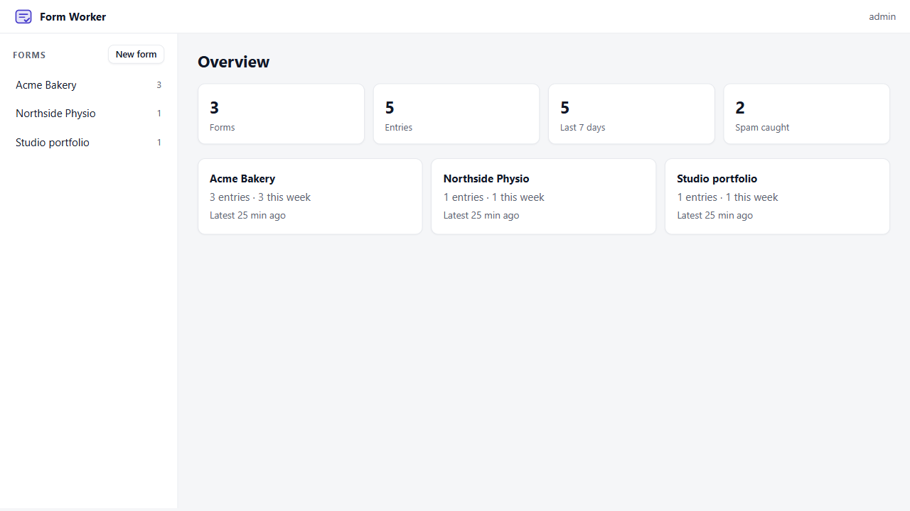
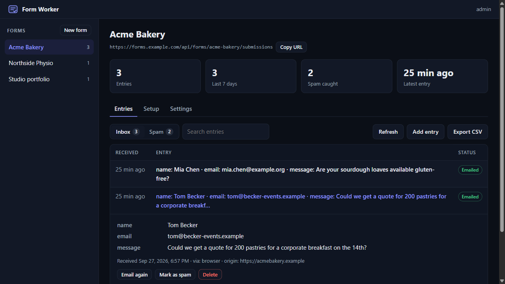
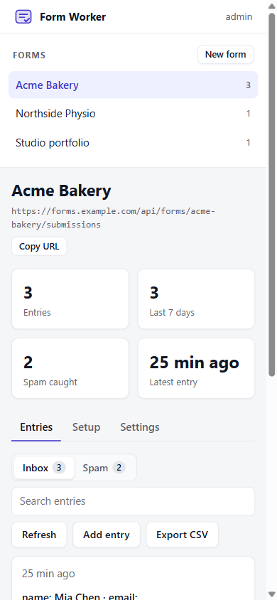

# Form Worker

A self-hosted form backend for the websites you build, running on your own Cloudflare account. It stores submissions, filters spam, and emails you about new entries. The dashboard covers every site you look after.

It runs on Cloudflare's free plan and sends mail through an SMTP account you already have, such as Gmail. There is no per-site fee, no submission cap, and no third-party form service holding your clients' enquiries.

[](https://deploy.workers.cloudflare.com/?url=https://github.com/AGSAVALIYA/form-worker)
[](https://github.com/AGSAVALIYA/form-worker/actions/workflows/ci.yml)
[](LICENSE)



## Who it is for

Freelancers and small studios who build sites for clients and need contact forms that just work. Deploy it once, then create one form per site. Each form has its own notification emails, allowed website, spam setting and retention period, and you see all of them in one place.

It also suits anyone moving a static site (Cloudflare Pages, GitHub Pages, Netlify, plain HTML) off a hosted form service.

## What it does

- **Receives submissions** from plain HTML forms, JavaScript `fetch`, or your own server code using an API key.
- **Stores them** in Cloudflare D1, a SQLite database in your account.
- **Emails you** for each new entry, to any number of addresses. *Reply-To* is set to the sender, so replying from your inbox answers them directly.
- **Filters spam** with rules that run inside the Worker, with no external service. Spam is kept, but not emailed, and each decision lists its reasons. You can mark entries as spam or not spam.
- **Blocks bots and unknown sites** with a honeypot field, a per-form list of allowed websites, and optional Cloudflare Turnstile.
- **Gives you a dashboard:** inbox and spam views, search, entry details, manual entries (for enquiries taken by phone), CSV export, and copy-paste setup snippets for each form.
- **Delivers reliably:** each entry is saved before its email is sent. Emails go out through a Cloudflare Queue, which retries a failed send three more times a minute apart, and anything still failing is retried every hour.
- **Deletes old data** automatically after each form's retention period.

## Screenshots

| Spam review | Email notification |
| --- | --- |
|  |  |
| **Setup snippets** | **Form settings** |
|  |  |
| **Overview** | **Dark mode** |
|  |  |

<details>
<summary>Mobile</summary>



</details>

## Quick start

You need a Cloudflare account (free) and an SMTP login. For Gmail, that is your address plus an [App Password](https://support.google.com/accounts/answer/185833). App Passwords need 2-Step Verification; your normal password will not work.

### Deploy with one click

1. Click **Deploy to Cloudflare** above. Cloudflare copies this repository to your GitHub account, creates the D1 database and the notification queue, runs the migrations and deploys the Worker. Future pushes to your copy deploy automatically.
2. Fill in the three secrets it asks for: `SMTP_USER`, `SMTP_PASS` and `ADMIN_PASSWORD`.
3. Open `https://form-worker.<your-subdomain>.workers.dev/admin` and sign in with any username and your `ADMIN_PASSWORD`.
4. Create a form, add your email under **Settings**, and press **Send test email**.

### Deploy from the command line

```bash
git clone https://github.com/AGSAVALIYA/form-worker.git
cd form-worker
npm install
npx wrangler login
npx wrangler d1 create form-worker        # put the printed database_id in wrangler.jsonc
npx wrangler secret put SMTP_USER
npx wrangler secret put SMTP_PASS
npx wrangler secret put ADMIN_PASSWORD
npm run deploy                            # applies migrations, then deploys (the first deploy also creates the queue)
```

## Connect a website

Each form's **Setup** tab has these snippets with its own URL filled in.

**Plain HTML** (works without JavaScript). First add the site's address, e.g. `https://www.client-site.com`, under **Settings → Allowed websites**:

```html
<form action="https://form-worker.<subdomain>.workers.dev/api/forms/acme-bakery/submissions" method="POST">
  <input name="name" required>
  <input name="email" type="email" required>
  <textarea name="message" required></textarea>
  <!-- honeypot: hidden from people, bots fill it in -->
  <input name="_gotcha" tabindex="-1" autocomplete="off" style="display:none">
  <button>Send</button>
</form>
```

Set a **thank-you page** in the form's settings to send visitors back to the site afterwards.

**JavaScript**, for forms that show their own confirmation:

```js
const response = await fetch(FORM_URL, {
  method: 'POST',
  headers: { Accept: 'application/json' },
  body: new FormData(form),
});
const { ok, error } = await response.json();
```

**From a server** (another backend, a Pages Function, a Worker), using the form's API key:

```bash
curl -X POST "$FORM_URL" \
  -H "Authorization: Bearer $API_KEY" \
  -H "Content-Type: application/json" \
  -d '{"name":"Sam","email":"sam@example.com","message":"Hello"}'
```

If the caller is another Worker or Pages project **on the same Cloudflare account**, use a [service binding](https://developers.cloudflare.com/workers/runtime-apis/bindings/service-bindings/) to `form-worker` and call `env.FORM_WORKER.fetch(request)`. A plain `fetch` between Workers on one account can be refused with error 1042.

## How spam filtering works

Each submission gets a score from 0 to 100. Entries at or above the form's threshold are filed as spam: they are stored in the Spam tab and not emailed. The sender still gets a normal success response, so bots learn nothing from it.

| Signal | Points |
| --- | --- |
| Links in the submission (1 / 2 / 3 or more) | 10 / 25 / 45 |
| HTML or BBCode links (`<a href>`, `[url=]`) | 40 |
| Link shorteners (bit.ly, tinyurl, …) | 20 |
| Spam phrases: SEO and backlink pitches, crypto, casino, pharma, "Dear Sir/Madam", … | 20 each, up to 50 |
| A link in the name field | 40 |
| Disposable email domain (mailinator, yopmail, …) | 30 |
| Same content submitted to the form in the last 24 hours | 30 |
| Every field has the same value | 25 |
| Random-looking filler text | 20 |
| Very long or numbers-only name, mostly capital letters, hidden zero-width characters | 10–15 |

Thresholds are **Off**, **Relaxed** (70), **Balanced** (50, the default) and **Strict** (35). The phrase list avoids words real enquiries use, such as "loan", "quote" or "price". The rules are one small function in [`src/spam.ts`](src/spam.ts), with tests in [`test/spam.test.ts`](test/spam.test.ts).

## Configuration

**Secrets**: set these under Worker → Settings → Variables and Secrets, or with `npx wrangler secret put`.

| Name | Required | Description |
| --- | --- | --- |
| `SMTP_USER` | yes | SMTP username. For Gmail, the full address. |
| `SMTP_PASS` | yes | SMTP password. For Gmail, an App Password. |
| `ADMIN_PASSWORD` | yes | Dashboard password (any username). Ignored once Cloudflare Access is configured. |
| `TURNSTILE_SECRET_KEY` | no | Only if a form requires Turnstile. |

**Variables**: set these in [`wrangler.jsonc`](wrangler.jsonc).

| Name | Default | Description |
| --- | --- | --- |
| `SMTP_HOST`, `SMTP_PORT` | `smtp.gmail.com`, `465` | Any SMTP server on port 465 (TLS) or 587 (STARTTLS). |
| `MAIL_FROM_NAME` | `Form Worker` | Sender name on notification emails. |

`ACCESS_TEAM_DOMAIN` and `ACCESS_AUD` are optional and not in `wrangler.jsonc`, so the Deploy button does not ask for them. Add them in the dashboard only if you use Cloudflare Access (below).

### Protect the dashboard with Cloudflare Access

A password over HTTP Basic auth works, but [Cloudflare Access](https://developers.cloudflare.com/workers/configuration/cloudflare-access/) is stronger, with one-time codes by email or sign-in with Google or GitHub.

1. Worker → **Settings → Domains & Routes** → enable **Cloudflare Access** and allow your email address.
2. Worker → **Settings → Variables and Secrets** → add `ACCESS_TEAM_DOMAIN` (your team domain, `<team>.cloudflareaccess.com`) and `ACCESS_AUD` (the Access application's **AUD tag**). Saving redeploys the Worker. `keep_vars` in `wrangler.jsonc` keeps them across later deploys.

If the dashboard says it expects Cloudflare Access and you do not use Access, delete both variables and sign in with `ADMIN_PASSWORD`.

The Worker then also verifies the token Access signs on every dashboard request, so a misconfigured route cannot expose the dashboard.

## Costs and limits

Everything below is covered by Cloudflare's free plan.

| Resource | Free allowance | Used per submission |
| --- | --- | --- |
| Worker requests | 100,000 per day | 1 |
| D1 rows written | 100,000 per day | about 2 |
| D1 storage | 5 GB | a few KB |
| Queue operations | 10,000 per day | about 3 per notification email |
| Gmail sending | about 500 recipients per day on a personal account | 1 per notification address |

Free Workers get 10 ms of CPU time per invocation. Waiting on the network (SMTP, the database) does not count toward it, but the TLS connection and SMTP exchange with Gmail do: an email costs roughly 10 ms on its own. That is why emails are not sent inside the submission request. The request saves the entry and puts a message on the queue (about 2 ms), and the queue sends the email in a separate invocation with its own budget. If a send fails or runs out of CPU, the queue retries it, and the hourly job is a second safety net. Your Worker's **Metrics** tab shows the CPU time per invocation.

The queue allows about 3,000 emails a day, well above what a personal Gmail account can send.

## Status and limitations

This is a young project (v1). The code has unit tests for the spam filter and the notification builder, and has been run end to end in Cloudflare's local runtime. It does not have a long production track record yet, so please [open an issue](https://github.com/AGSAVALIYA/form-worker/issues) if something breaks.

Known limitations:

- **One dashboard login.** No multiple users or per-client access yet. (Cloudflare Access can allow several people, but they all see every form.)
- **No file uploads.** File fields are ignored.
- **Rule-based spam filter.** It catches the common junk that contact forms get, but it is not a trained classifier, and its phrase list is English. Check the Spam tab now and then, especially on Strict.
- **No per-IP rate limiting.** Repeated submissions are scored as duplicates, and Turnstile is available for forms that are targeted.
- **Gmail's "From" is always your Gmail address.** Gmail rewrites it; *Reply-To* still points at the person who submitted.

## API

| Method | Path | Description |
| --- | --- | --- |
| `POST` | `/api/forms/:id/submissions` | Submit an entry: JSON, urlencoded or multipart (files ignored), up to 64 KB. |
| `OPTIONS` | `/api/forms/:id/submissions` | CORS preflight for allowed websites. |

- **Authentication:** `Authorization: Bearer <api key>` for servers, or an `Origin` listed in the form's allowed websites for browsers.
- **Responses:** `201 {"ok":true,"id":"…"}`. Errors return `{"ok":false,"error":"…"}` with status 400, 401, 403, 404, 413, 415 or 422. Plain HTML posts are redirected to the thank-you page, or shown a simple confirmation.
- **Control fields** (not stored): `_gotcha` (honeypot), `_redirect` (thank-you URL; only followed if it is on an allowed website), `cf-turnstile-response`.
- A JSON body shaped `{"fields": {...}, "kind": "enquiry"}` stores `fields` as the entry and the other top-level values as metadata.

The dashboard talks to a private JSON API under `/admin/api/*`.

## Development

```bash
npm install
cp .dev.vars.example .dev.vars    # SMTP details and an admin password
npm run db:migrate:local
npm run dev                       # http://localhost:8787/admin
npm test
npm run typecheck                 # also generates worker-configuration.d.ts
```

```
src/
  index.ts       routing, the queue consumer and the hourly job (retries and retention)
  submit.ts      public submission endpoint
  spam.ts        spam scoring
  notify.ts      notification emails (via worker-mailer) and the queue that sends them
  db.ts          D1 queries
  admin/         dashboard: auth, JSON API and UI (plain HTML, CSS and JS; no build step)
migrations/      D1 schema
test/            Vitest unit tests
```

Dependencies: [`worker-mailer`](https://github.com/zou-yu/worker-mailer) for SMTP from Workers, and [`jose`](https://github.com/panva/jose) to verify Cloudflare Access tokens.

## Privacy

Submissions are personal data. Set each form's retention period to match the site's privacy policy, keep the dashboard behind Access or a strong password, and list Cloudflare (hosting and storage) and your email provider (delivery) as processors in that policy.

## Contributing

Bug reports, spam samples that slip through, and pull requests are welcome. See [CONTRIBUTING.md](CONTRIBUTING.md), and [SECURITY.md](SECURITY.md) for reporting vulnerabilities.

## License

[MIT](LICENSE) © Akshit Savaliya
